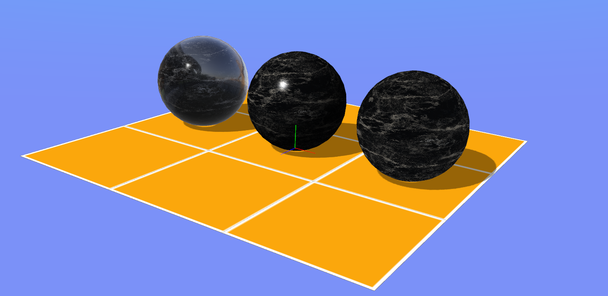

CROGINE World Editor, Model Converter and Material Editor (WIP)
---------------------------------------------------------------

World Editor allows importing models into a scene and placing them in world space. Current plan is only for geometry layout - gameplay programming is still required in code.

Model Converter allows opening and importing model files for conversion to the crogine model format, as well as displaying data such as material info and animation data. See `cro_mesh_format.md` for details on the mesh file format, and `model_definition_format.md` for examples on authoring model definition files.

Material Editor is designed for fast preview and easy reuse of material definitions which can be applied to models loaded in the model converter/viewer.

-----------------------------------------------------------------------

Matt Marchant 2020 - 2022  
http://trederia.blogspot.com  

crogine - Zlib license.  

This software is provided 'as-is', without any express or  
implied warranty. In no event will the authors be held  
liable for any damages arising from the use of this software.  

Permission is granted to anyone to use this software for any purpose,  
including commercial applications, and to alter it and redistribute  
it freely, subject to the following restrictions:  

1. The origin of this software must not be misrepresented;  
you must not claim that you wrote the original software.  
If you use this software in a product, an acknowledgment  
in the product documentation would be appreciated but  
is not required.  

2. Altered source versions must be plainly marked as such,  
and must not be misrepresented as being the original software.  

3. This notice may not be removed or altered from any  
source distribution.  

-----------------------------------------------------------------------
